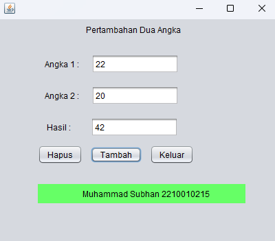

# AplikasiPenghitungUmur
 Latihan 1 - Muhammad Subhan (2210010215)
 
# AplikasiPertambahanDuaAngka
 
Aplikasi Pertambahan Dua Angka Adalah Pertambahan Berupa Angka 1 dan Angka 2 dan ketika di hapus maka semua kursor akan terhapus dan kembali ke Angka 1

# Keunggulan Aplikasi

- *Pertambahan Dua Angka*: Aplikasi ini menghitung angka 1 dan angka 2.
  
# Pembuat Aplikasi
 Muhammad Subhan - 2210010215 - Latihan 2

# Fitur

Aplikasi ini menawarkan fitur:

*Penghitungan Dua Angka*  
   Menghitung Angka 1 dan Angka 2 .

## Cara Menjalankan

1. Run File
2. Ketikkan Angka 1 dan Angka 2
3. Tekan Tambah Bada Button Tambah
4. Maka Hasil Akan Tampil, Tekan Hapus pada Button Hapus, Jika Ingin Menghapus, dan Tekan Button Keluar, jika ingin keluar 

# Demo
 
